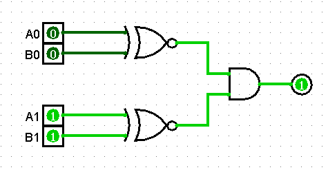

2. Dar la tabla de verdad para la compuerta AND de 3 entradas.

|   A<small>0</small>   |   A<small>1</small>   |   B<small>0</small>   |   B<small>1</small>   |   R   |
| :---: | :---: | :---: | :---: | :---: |
|   0   |   0   |   0   |   0   |   1   |
|   0   |   0   |   0   |   1   |   0   |
|   0   |   0   |   1   |   0   |   0   |
|   0   |   0   |   1   |   1   |   0   |
|   0   |   1   |   0   |   0   |   0   |
|   0   |   1   |   0   |   1   |   1   |
|   0   |   1   |   1   |   0   |   0   |
|   0   |   1   |   1   |   1   |   0   |
|   1   |   0   |   0   |   0   |   0   |
|   1   |   0   |   0   |   1   |   0   |
|   1   |   0   |   1   |   0   |   1   |
|   1   |   0   |   1   |   1   |   0   |
|   1   |   1   |   0   |   0   |   0   |
|   1   |   1   |   0   |   1   |   0   |
|   1   |   1   |   1   |   0   |   0   |
|   1   |   1   |   1   |   1   |   1   |

