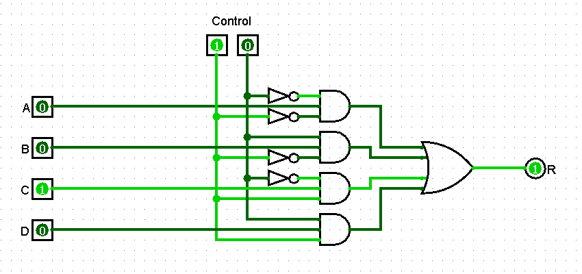

5. Dar el circuito y la tabla de verdad resumida para un multiplexor 4:1.

|   A   |   B   |   C   |   D   |   C   |   R   |
| :---: | :---: | :---: | :---: | :---: | :---: |
|   0   |   0   |   0   |   0   |   00  |   0   |
|   0   |   1   |   0   |   1   |   01  |   1   |
|   0   |   1   |   0   |   0   |   10  |   0   |
|   0   |   1   |   1   |   1   |   11  |   1   |