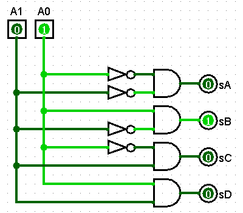
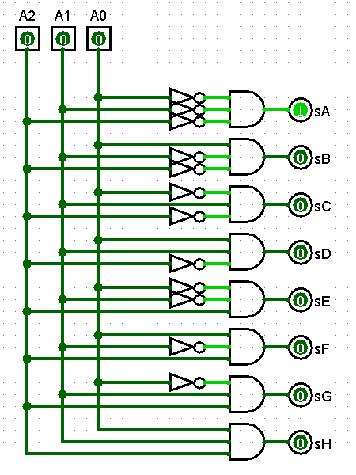

6. Dar el circuito del decodificador 2:4. Dar circuito y tabla para el decodificador 3:8.

Decodificador 2:4

Decodificador 3:8

|   A0  |   A1  |   A2  |   R   |
| :---: | :---: | :---: | :---: |
|   0   |   0   |   0   |   sA  |
|   0   |   0   |   1   |   sB  |
|   0   |   1   |   0   |   sC  |
|   0   |   1   |   1   |   sD  |
|   1   |   0   |   0   |   sE  |
|   1   |   0   |   1   |   sF  |
|   1   |   1   |   0   |   sG  |
|   1   |   1   |   1   |   sH  |