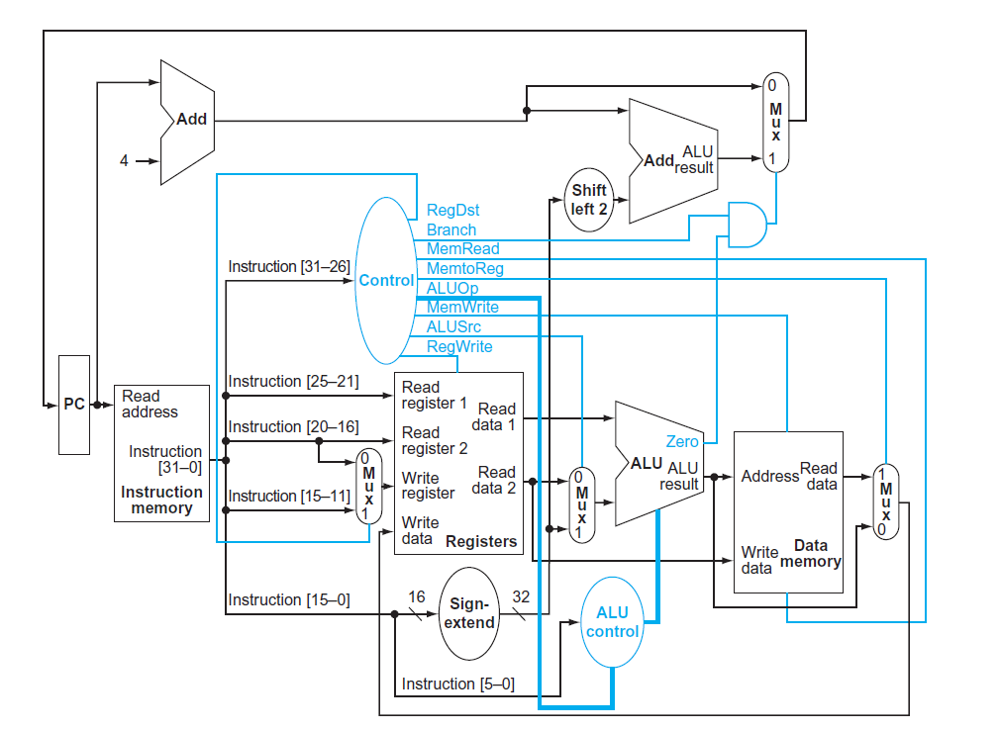

1. ¿Para qué sirve el multiplexor antes de la entrada B de la ALU? Dar ejemplos de dos instrucciones donde se elija entre una u otra entrada del multiplexor.

Sirve para seleccionar entre un registro y una constante o número inmediato para la operación que se realiza.

En el caso de una instrucción `add    $t0, $t0, $t1` se elige la entrada 0 del multiplexor ya que se está leyendo el valor almacenado en un registro. Esta entrada se elige en todas las instrucciones de tipo R.

Y en el caso de una instrucción `addi    $t0, $t0, 1` se eliige la entrada 1 del multiplexor ya que se está leyendo un número inmediato o una constante. Esta entrada se elige en todas las instrucciones de tipo I.