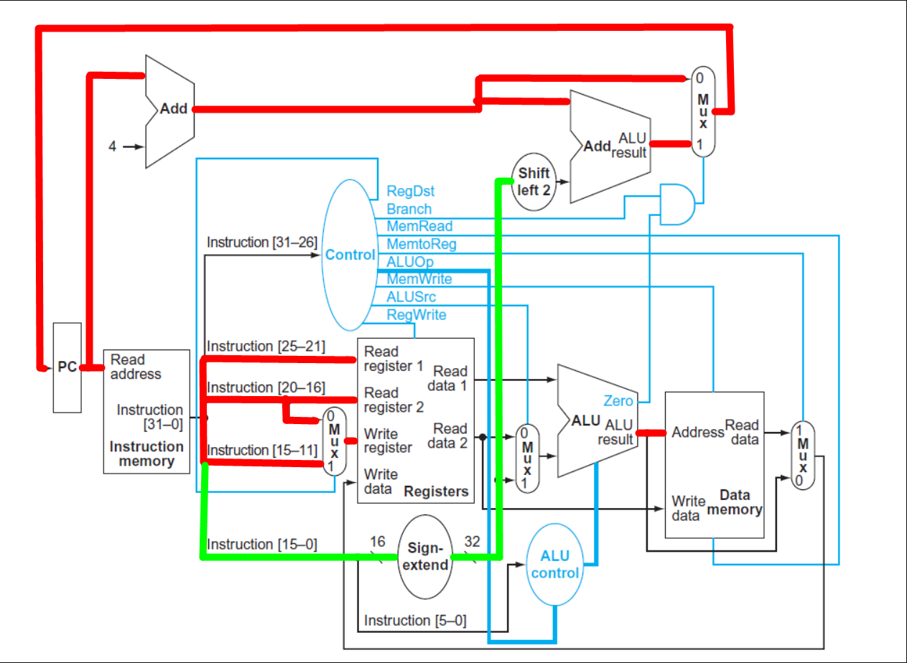

3. Sabiendo que en una computadora existen buses para **datos**, **direcciones** y **control**. Y que en el diagrama del _datapath_ los cables del bus de control están resaltados en azul. Marcar en rojo los buses de direcciones y dejar en negro los buses de datos en el diagrama. ¿Encuentran alguna conexión que pueda interpretarse como de datos o direcciones según cambie la instrucción a ejecutar?

Los buses marcados en verde son los que pueden ser interpretados como datos o direcciones según cambie la instrucción a ejecutar.