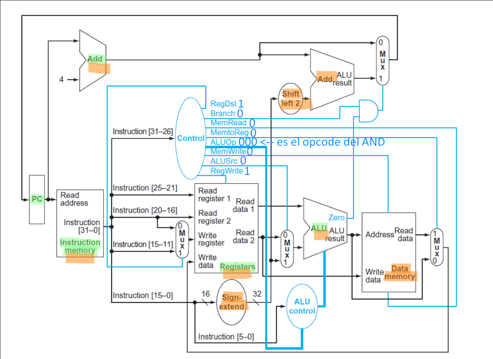

4. Considere la siguiente instrucción `and $t0, $t1, $t2`. ¿Qué valores toman las señales de control? ¿Qué unidades funcionales realizan una tarea útil? ¿Qué unidades producen una salida pero esa salida no se usa en la instrucción?

Como se observa el diagrama, los valores toman las señales de control son los siguientes:

|RegDst|Branch|MemRead|MemtoReg|ALUOp|MemWrite|ALUSrc|RegWrite|
|---|---|---|---|---|---|---|---|
|1|0|0|0|000|0|0|1|

Las unidades funcionales que realizan una tarea útil (marcadas en verde) son:
 - PC
 - Instruction Memory
 - Adder del PC
 - Registers
 - ALU

Todas las unidades menos el PC producen una salida que no es utilizada en la instrucción.