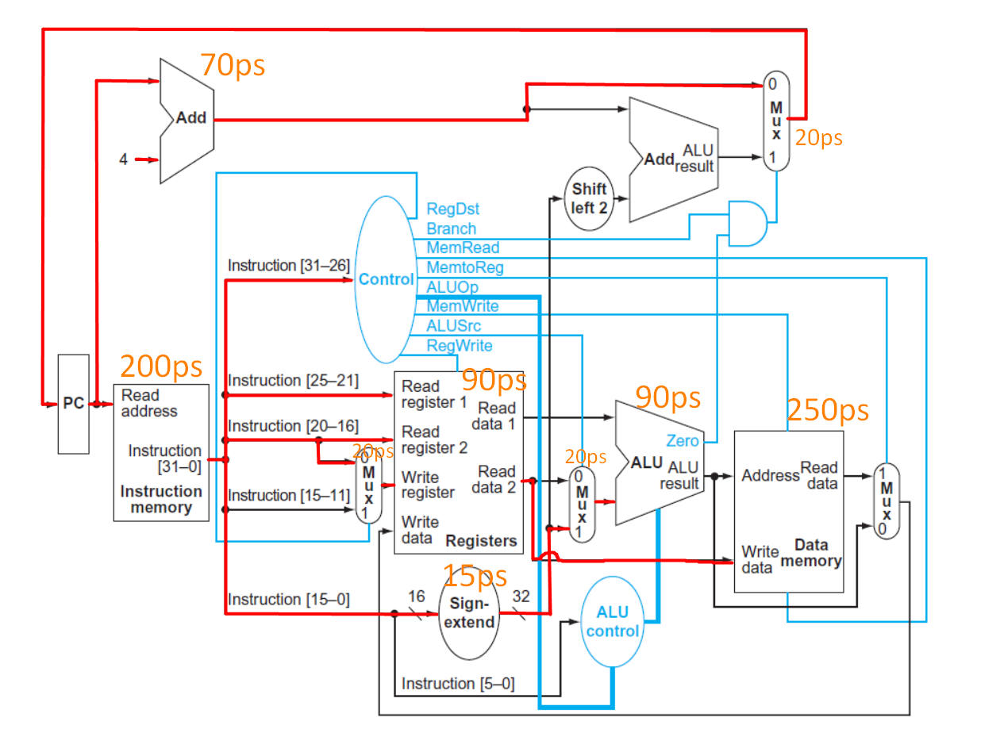
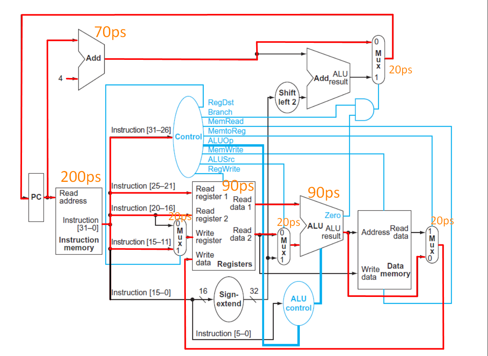
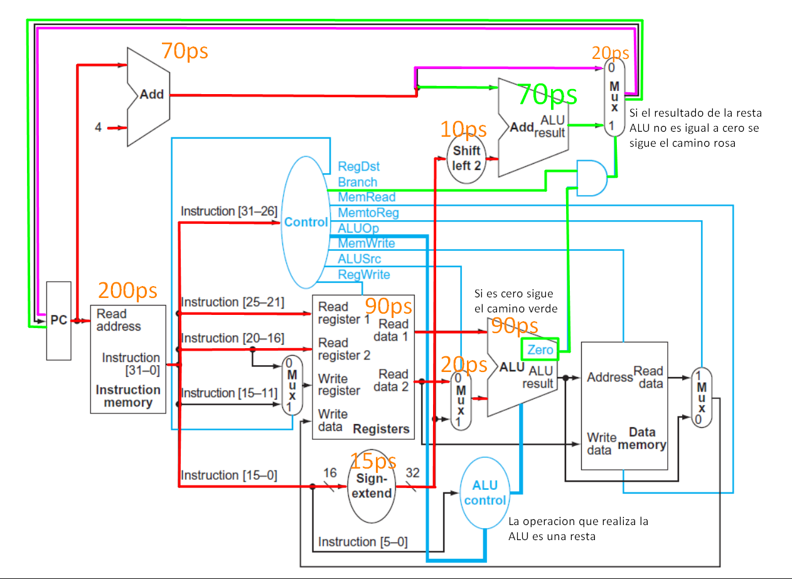

6. Marcar el camino crítico para las instrucciones `lw`, `sw`, `add` y `beq` en el diagrama del *datapath* sacado del libro de Patterson (el que está en el blog). El camino crítico es el camino más largo que recorre una instrucción de inicio a fin. Usar los tiempos de propagación del ejercicio 8.

|Instr Mem|Add|Mux|ALU|Reg File|Data Mem|Sign extend|Shift left 2|
|---|---|---|---|---|---|---|---|
|200ps|70ps|20ps|90ps|90ps|250ps|15ps|10ps|

### Camino de `lw`:

Tiempo total de ejecución = Instr Mem + Add + Mux + Mux + Sign extend + Mux + ALU + Data Mem + Mux + Reg File

Tiempo total de ejecución = 200ps + 70ps + 20ps + 20ps + 15ps + 20ps + 90ps + 250ps + 20ps + 90ps

Tiempo total de ejecución = 795ps

### Camino de `sw`:

Tiempo total de ejecución = Instr Mem + Add + Mux + Mux + Reg File + Sign extend + Mux + ALU + Data Mem

Tiempo total de ejecución = 200ps + 70ps + 20ps + 20ps + 90ps + 15ps + 20ps + 90ps + 250ps

Tiempo total de ejecución = 775ps

### Camino de `add`:

Tiempo total de ejecución = Instr Mem + Add + Mux + Mux + Reg File + Mux + ALU + Mux

Tiempo total de ejecución = 200ps + 70ps + 20ps + 20ps + 90ps + 20ps + 90ps + 20ps

Tiempo total de ejecución = 530ps

### Camino de `beq`:

Tiempo total de ejecución (si no se cumple el `beq`) = Instr Mem + Add + Mux + Reg File + Sign extend + Mux + Shift left 2 + ALU

Tiempo total de ejecución (si no se cumple el `beq`) = 200ps + 70ps + 20ps + 90ps + 15ps + 20ps + 10ps + 90ps

Tiempo total de ejecución (si no se cumple el `beq`) = 515ps

-----

Tiempo total de ejecución (si se cumple el `beq`) = Instr Mem + Add + Mux + Reg File + Sign extend + Mux + Shift left 2 + Add + ALU

Tiempo total de ejecución (si se cumple el `beq`) = 200ps + 70ps + 20ps + 90ps + 15ps + 20ps + 10ps + 70ps + 90ps

Tiempo total de ejecución (si se cumple el `beq`) = 585ps